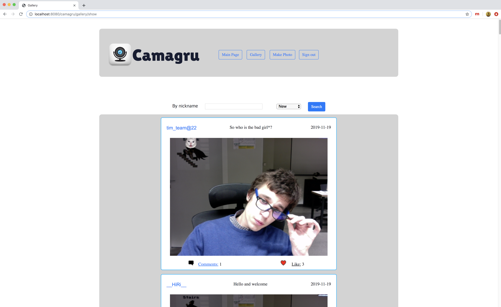
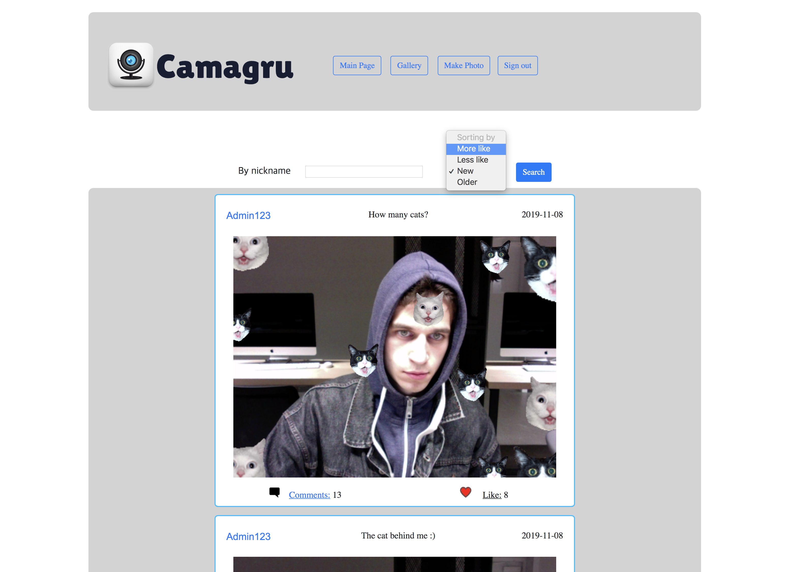
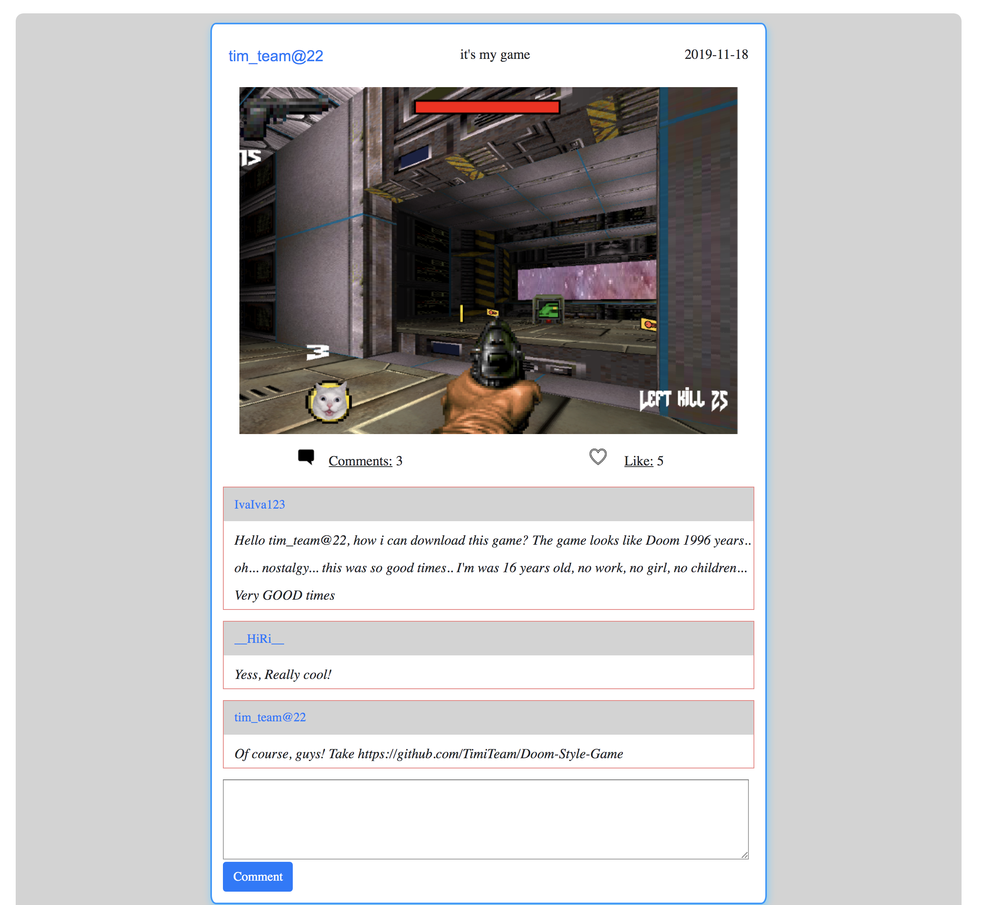
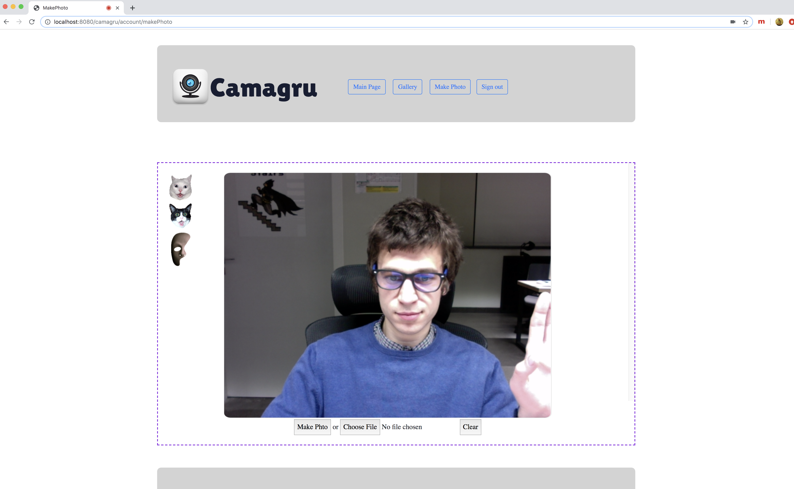
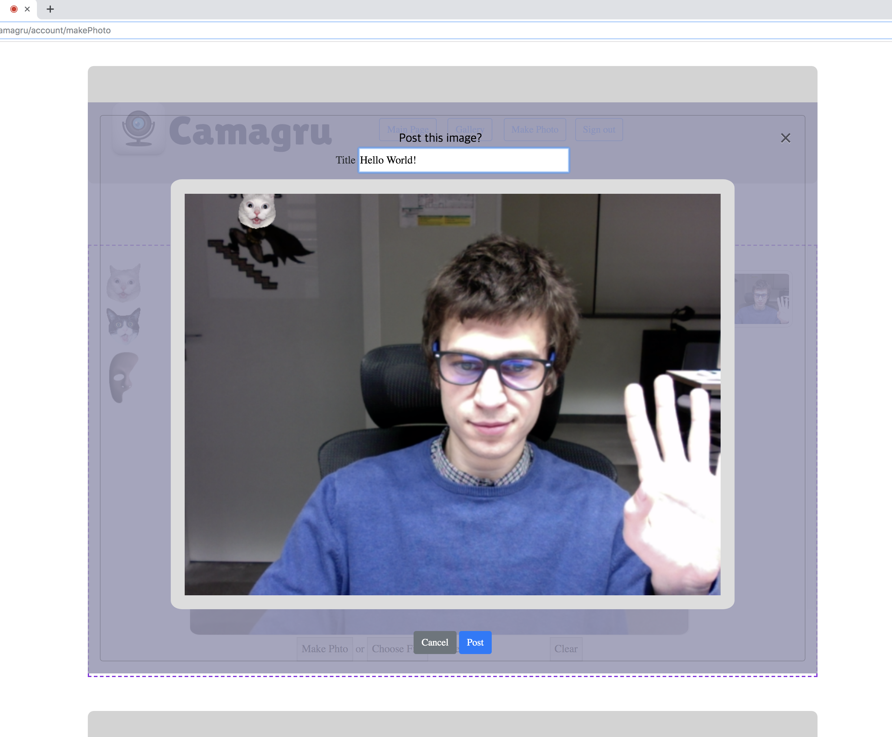

# Camagru
This web project is a small web application allowing you to make basic photo and video editing using your webcam and some predefined images.

#User: The application allow a user to sign up by asking at least a valid email address, an username and a password with at least a minimum level of complexity.
At the end of the registration process, an user should confirm his account via a unique link sent at the email address fullfiled in the registration form.
User can modify his username, mail address or password.
Aslo user can make basic photo using your webcam or upload from PC and combination predefined images.
#Gallery: All posts is public and display all the images edited by all the users, ordered by date of creation (by default) or with other filters.
Only a connected user can like them and/or comment them. When an image receives a new comment, the author of the image notified by email.
This preference set as true by default but can be deactivated in user’s preferences.

Gallery

Searching

Comments to Post

Enemy

Making photp

Make post

